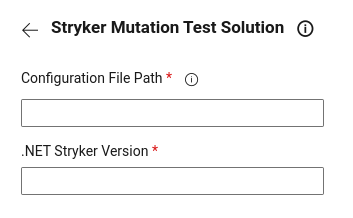

## Stryker Mutation Test Solution

Allows you to run Stryker mutation tests for a .NET Solution in azure pipelines.

## Usage
Add a new task, select **Stryker Mutation Test Solution** from the **Test** category and configure it as needed.


Parameters include:
- **Config File Path**: Path to Stryker .NET Solution configuration file. [Click here to read more](https://github.com/JRafaelNascimento/stryker-dotnet-solution#readme)
- **Dotnet Stryker Version**: .NET Stryker Version.



Also, its possible to configure directly to Azure Pipeline YAML:

```yaml
- task: stryker-solution-test@1
  displayName: Mutation Tests
  inputs:
    configFilePath: 'tests/stryker-multi-project-config.json'
    dotnetStrykerVersion: '2.1.2'
```

## Release notes

**New in 1.0.7**
- Runs Stryker .NET Mutation tests for all configured projects;

## Related Links

- [Stryker Dotnet Solution Repository](https://github.com/JRafaelNascimento/stryker-dotnet-solution)